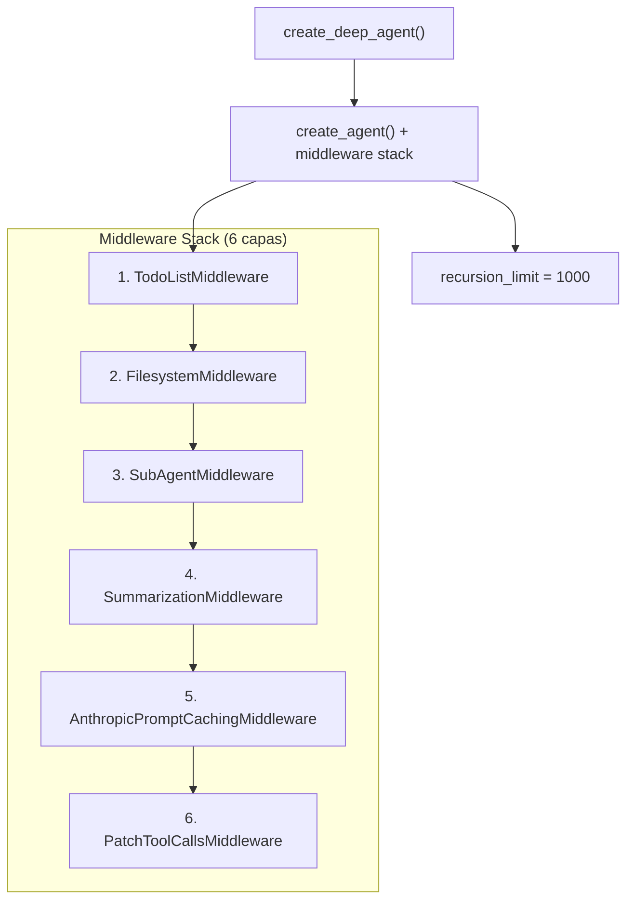
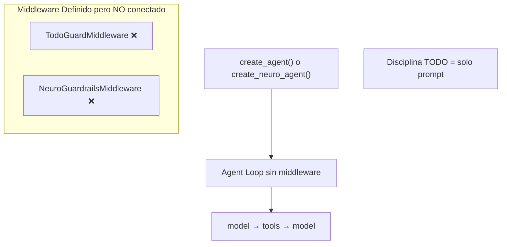

# Análisis Comparativo: Official DeepAgents vs Local Fork

## 1. Arquitectura General

### Official (`langchain-ai/deepagents`)



### Local Fork (`deep_agents_from_scratch` + [neuro_agent](file:///home/juansebas7ian/deep-agents-from-scratch/notebooks/4_full_neuro_agent.py#249-265))



> [!CAUTION]
> **Diferencia crítica #1**: El fork local **no conecta** sus middleware al agente. La librería oficial sí los conecta vía [create_agent(middleware=[...])](file:///home/juansebas7ian/deep-agents-from-scratch/apps/supervisor/graph.py#6-18).

---

## 2. Origen del TodoListMiddleware

| Aspecto | Official | Local Fork |
|---------|----------|-----------|
| **Ubicación** | `langchain.agents.middleware.TodoListMiddleware` — **viene de LangChain core** | `deep_agents_from_scratch.todo_guard.TodoGuardMiddleware` — reimplementación propia |
| **Conexión** | ✅ Pasado a [create_agent(middleware=[...])](file:///home/juansebas7ian/deep-agents-from-scratch/apps/supervisor/graph.py#6-18) | ❌ Definido pero nunca registrado |
| **Escape valve** | Gestionado internamente por LangChain | `MAX_GUARD_RETRIES = 3` (implementación propia) |

> [!IMPORTANT]
> El `TodoListMiddleware` oficial es un componente **de LangChain**, no de deepagents. DeepAgents simplemente lo incluye en su stack. Esto significa que si usas `langchain >= 1.0`, ya tienes acceso a este middleware sin necesidad de fork.

---

## 3. ¿Por qué el middleware NO cae en recursión?

Hay **4 mecanismos** que lo previenen (en la librería oficial):

### 3.1 `recursion_limit = 1000`

```python
# graph.py final line
return create_agent(...).with_config({"recursion_limit": 1000})
```

Permite hasta 1000 iteraciones del loop `model → tools → model`, pero **no es recursión infinita** — cada iteración es un paso lineal del grafo.

### 3.2 Middleware son hooks, no loops

Cada middleware implementa hooks [after_model](file:///home/juansebas7ian/deep-agents-from-scratch/src/deep_agents_from_scratch/todo_guard.py#49-52) / `before_model`. Estos hooks:
- Se ejecutan **una vez** por iteración del grafo
- Retornan `None` (pasar) o `Command(goto="model")` (redirigir)
- **No se llaman a sí mismos** — es el grafo quien los invoca

### 3.3 El flujo es acíclico dentro de cada paso

```
model call → after_model hooks (secuencial) → decision → tools o END
```

Los hooks no crean ciclos adicionales. Si un hook redirige con `Command(goto="model")`, cuenta como **una nueva iteración** del grafo (consume 1 del `recursion_limit`).

### 3.4 Sub-agentes tienen su propio budget

Cada [task()](file:///home/juansebas7ian/deep-agents-from-scratch/src/neuro_agent/infrastructure/tools/delegation.py#61-112) crea un sub-agente con su **propio** `recursion_limit`. No comparten el budget del padre.

---

## 4. Comparación de Tools

| Tool | Official | Local Fork |
|------|----------|-----------|
| `write_todos` / `read_todos` | ✅ Via `TodoListMiddleware` | ✅ Reimplementado |
| [ls](file:///home/juansebas7ian/deep-agents-from-scratch/src/deep_agents_from_scratch/skills.py#54-76) | ✅ Via `FilesystemMiddleware` | ✅ |
| `read_file` | ✅ Con paginación (offset/limit) | ✅ Con paginación |
| `write_file` | ✅ | ✅ |
| `edit_file` | ✅ Edición parcial inteligente | ❌ No existe |
| `glob` | ✅ Pattern matching | ❌ No existe |
| `grep` | ✅ Búsqueda en archivos | ❌ No existe |
| `execute` | ✅ Shell sandboxed | ❌ No existe |
| [task](file:///home/juansebas7ian/deep-agents-from-scratch/src/neuro_agent/infrastructure/tools/delegation.py#61-112) (sub-agents) | ✅ Via `SubAgentMiddleware` | ✅ Reimplementado |
| [tavily_search](file:///home/juansebas7ian/deep-agents-from-scratch/src/deep_agents_from_scratch/research_tools.py#128-187) | ❌ No incluido (es custom) | ✅ Incluido |
| [think_tool](file:///home/juansebas7ian/deep-agents-from-scratch/src/deep_agents_from_scratch/research_tools.py#188-192) | ❌ No incluido | ✅ Incluido |

> [!NOTE]
> La oficial tiene **6 herramientas de filesystem** (ls, read, write, edit, glob, grep) + shell. El fork local tiene 3 (ls, read, write) + search + think.

---

## 5. Comparación de Prompts

### Official: Base Prompt (~350 palabras, conciso)
- "Be concise and direct"
- "Understand → Act → Verify" loop
- Sin instrucciones de TODO enforcement — eso lo hace el middleware
- Sin instrucciones de filesystem detalladas — eso lo inyecta `FilesystemMiddleware`

### Local Fork: System Prompt (~1000+ palabras, verboso)
- `TODO_USAGE_INSTRUCTIONS`: ~300 palabras de reglas estrictas
- `FILE_USAGE_INSTRUCTIONS`: ~150 palabras con "ABSOLUTE FIRST STEP"
- `SUBAGENT_USAGE_INSTRUCTIONS`: ~300 palabras con scaling rules
- `RESEARCHER_INSTRUCTIONS`: ~250 palabras con hard limits

> [!WARNING]
> **Diferencia crítica #2**: La versión oficial delega el enforcement de TODO al **middleware**, no al prompt. El fork local pone TODA la disciplina en el prompt porque el middleware no está conectado. Esto es mucho más frágil — depende 100% de que el modelo obedezca las instrucciones.

---

## 6. Middleware que el Fork NO tiene

| Middleware | Función | Impacto |
|-----------|---------|---------|
| `SummarizationMiddleware` | Auto-resume del historial cuando excede tokens | Sin esto, el agente puede perder contexto en tareas largas |
| `AnthropicPromptCachingMiddleware` | Cache de prefix para reducir costos | Solo funciona con Anthropic |
| `PatchToolCallsMiddleware` | Corrige formatos de tool calls malformados | Previene errores de parsing |
| `SkillsMiddleware` | Carga skills desde filesystem real | Fork tiene versión propia en estado |
| `MemoryMiddleware` | Carga `AGENTS.md` en system prompt | No existe en fork |

---

## 7. Backend System (exclusivo de la oficial)

La oficial tiene un sistema de **backends** pluggable:

```python
# StateBackend — archivos en el state dict (como el fork local)
# FilesystemBackend — archivos reales en disco
# SandboxBackendProtocol — ejecución sandboxed (Modal, Runloop, Daytona)
```

El fork local solo tiene el equivalente de `StateBackend` (dictionary en state).

---

## 8. Recomendación Final para Nova

### ¿Adaptar la oficial o from scratch?

````carousel
### Opción A: Usar `pip install deepagents` directamente

```python
from deepagents import create_deep_agent
from langchain_aws import ChatBedrockConverse

model = ChatBedrockConverse(model="us.amazon.nova-pro-v1:0", region_name="us-east-1")
agent = create_deep_agent(model=model, tools=[tavily_search, think_tool])
```

**Pros**: TodoListMiddleware listo, FilesystemMiddleware completo, SummarizationMiddleware auto  
**Contras**: `AnthropicPromptCachingMiddleware` no aplica, `PatchToolCallsMiddleware` puede interferir, prompts optimizados para Sonnet
<!-- slide -->
### Opción B: Hybrid — Instalar oficial + customize para Nova

```python
from deepagents import create_deep_agent
from langchain.agents.middleware import TodoListMiddleware
from deepagents.middleware.filesystem import FilesystemMiddleware
from deepagents.middleware.summarization import SummarizationMiddleware

agent = create_deep_agent(
    model=nova_model,
    tools=[tavily_search, think_tool],
    middleware=[],  # Override: quitar Anthropic-specific
    system_prompt="Instrucciones concisas para Nova...",
)
```

**Pros**: Reusar infra probada, quitar lo Anthropic-specific  
**Contras**: Requiere testing con Nova
<!-- slide -->
### Opción C: MVP from scratch con componentes cherry-picked

```python
# Usar TodoListMiddleware de langchain.agents.middleware
# Implementar StateGraph manual con conditional edges
# Reescribir prompts concisos para Nova
# Mantener tus neuro_guardrails como middleware adicional
```

**Pros**: Control total, sin dependencias innecesarias  
**Contras**: Más trabajo, no tienes Summarization
````

### Mi Recomendación

**Opción B** (Hybrid con la oficial) es la más viable:

1. `pip install deepagents` — te da TodoList, Filesystem, SubAgent, Summarization **gratis**
2. Quitar `AnthropicPromptCachingMiddleware` y `PatchToolCallsMiddleware` (son Anthropic-specific)  
3. Reescribir el [system_prompt](file:///home/juansebas7ian/deep-agents-from-scratch/src/deep_agents_from_scratch/skills.py#78-107) para Nova (conciso, directivo)
4. Agregar tu [NeuroGuardrailsMiddleware](file:///home/juansebas7ian/deep-agents-from-scratch/src/neuro_agent/infrastructure/neuro_guardrails.py#27-193) como middleware adicional
5. Agregar [tavily_search](file:///home/juansebas7ian/deep-agents-from-scratch/src/deep_agents_from_scratch/research_tools.py#128-187) y [think_tool](file:///home/juansebas7ian/deep-agents-from-scratch/src/deep_agents_from_scratch/research_tools.py#188-192) como tools custom

| Paso | Esfuerzo | Riesgo |
|------|----------|--------|
| Instalar y probar con Nova | 2 horas | Bajo |
| Quitar middleware Anthropic | 30 min | Bajo |
| Reescribir prompts | 4 horas | Medio |
| Integrar NeuroGuardrails | 2 horas | Bajo |
| Testing E2E | 4 horas | Medio |
| **Total** | **~1.5 días** | **Bajo-Medio** |
